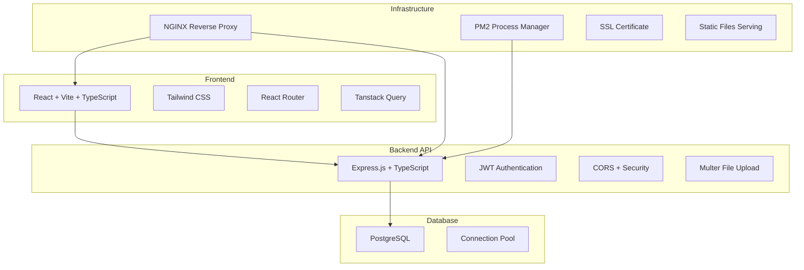

# Arquitetura do Sistema - TumiGestão

## 🏗️ Visão Geral da Arquitetura



## 📁 Estrutura do Projeto

### Frontend (`/`)
- **Framework**: React 18 + Vite + TypeScript
- **Styling**: Tailwind CSS + Shadcn/ui
- **Routing**: React Router v6
- **State Management**: Tanstack Query + Context API
- **Build**: Vite (produção otimizada)

### Backend (`/server`)
- **Runtime**: Node.js + TypeScript
- **Framework**: Express.js
- **Authentication**: JWT + bcryptjs
- **Database**: PostgreSQL + pg driver
- **File Upload**: Multer
- **Security**: CORS, rate limiting

## 🗄️ Schema do Banco de Dados

### Tabelas Principais

#### `companies` - Empresas
```sql
- id (UUID, PK)
- name (TEXT, NOT NULL)
- cnpj (TEXT)
- email (TEXT)
- phone (TEXT)
- address, city, state, zip_code (TEXT)
- logo_url (TEXT)
- primary_color, secondary_color (TEXT)
- website, facebook_url, instagram_url (TEXT)
- whatsapp_number (TEXT)
- creator_id (UUID)
- created_at, updated_at (TIMESTAMP)
```

#### `profiles` - Perfis de Usuário
```sql
- id (UUID, PK)
- company_id (UUID, FK -> companies.id)
- full_name (TEXT)
- email (TEXT)
- phone (TEXT)
- role (TEXT: 'admin', 'user')
- avatar_url (TEXT)
- created_at, updated_at (TIMESTAMP)
```

#### `products` - Produtos
```sql
- id (UUID, PK)
- company_id (UUID, FK -> companies.id)
- category_id (UUID, FK -> product_categories.id)
- name (TEXT, NOT NULL)
- description (TEXT)
- sku (TEXT)
- barcode (TEXT)
- price (NUMERIC, NOT NULL)
- cost_price (NUMERIC)
- stock_quantity (INTEGER)
- min_stock, max_stock (INTEGER)
- profit_margin_percentage (NUMERIC)
- unit (TEXT)
- image_url (TEXT)
- active (BOOLEAN)
- created_at, updated_at (TIMESTAMP)
```

#### `customers` - Clientes
```sql
- id (UUID, PK)
- company_id (UUID, FK -> companies.id)
- name (TEXT, NOT NULL)
- email (TEXT)
- phone (TEXT)
- document (TEXT)
- document_type (TEXT: 'cpf', 'cnpj')
- address, city, state, zip_code (TEXT)
- birth_date (DATE)
- notes (TEXT)
- active (BOOLEAN)
- created_at, updated_at (TIMESTAMP)
```

#### `sales` - Vendas
```sql
- id (UUID, PK)
- company_id (UUID, FK -> companies.id)
- customer_id (UUID, FK -> customers.id)
- sale_number (TEXT, NOT NULL)
- total_amount (NUMERIC, NOT NULL)
- discount_amount, tax_amount (NUMERIC)
- status (TEXT: 'draft', 'completed', 'cancelled')
- payment_method (TEXT)
- payment_status (TEXT: 'pending', 'completed', 'failed')
- due_date (DATE)
- notes (TEXT)
- created_at, updated_at (TIMESTAMP)
```

#### `sale_items` - Itens de Venda
```sql
- id (UUID, PK)
- sale_id (UUID, FK -> sales.id)
- product_id (UUID, FK -> products.id)
- quantity (NUMERIC, NOT NULL)
- unit_price (NUMERIC, NOT NULL)
- discount_percentage (NUMERIC)
- total_price (NUMERIC, NOT NULL)
- created_at (TIMESTAMP)
```

### Módulos Adicionais

#### Financeiro
- `accounts_receivable` - Contas a Receber
- `accounts_payable` - Contas a Pagar

#### Orçamentos
- `quotes` - Orçamentos
- `quote_items` - Itens do Orçamento
- `online_quotes` - Solicitações Online

#### Fornecedores
- `suppliers` - Fornecedores
- `product_purchases` - Compras de Produtos

#### Automação
- `automation_flows` - Fluxos de Automação
- `automation_logs` - Logs de Execução
- `integrations` - Integrações

#### Outros
- `agenda_events` - Eventos da Agenda
- `ai_insights` - Insights de IA
- `audit_logs` - Logs de Auditoria
- `marketing_campaigns` - Campanhas de Marketing
- `crm_leads` - Leads do CRM

## 🔐 Sistema de Autenticação

### Fluxo de Autenticação
1. **Login**: POST `/auth/login` - Retorna JWT token
2. **Registro**: POST `/auth/register` - Cria usuário e profile
3. **Token Validation**: Middleware valida JWT em rotas protegidas
4. **Session Management**: Token armazenado no localStorage

### Middleware de Autenticação
```typescript
// server/middleware/auth.ts
- Valida JWT token
- Extrai userId do token
- Verifica se usuário existe
- Adiciona userId ao req.user
```

## 🌐 API Endpoints

### Autenticação (`/auth`)
```
POST /auth/login - Login
POST /auth/register - Registro
GET /auth/me - Dados do usuário logado
PUT /auth/change-password - Alterar senha
```

### Empresas (`/companies`)
```
GET /companies - Listar empresas do usuário
POST /companies - Criar empresa
PUT /companies/:id - Atualizar empresa
GET /companies/:id - Detalhes da empresa
```

### Produtos (`/products`)
```
GET /products - Listar produtos
POST /products - Criar produto
PUT /products/:id - Atualizar produto
DELETE /products/:id - Deletar produto
```

### Vendas (`/sales`)
```
GET /sales - Listar vendas
POST /sales - Criar venda
PUT /sales/:id - Atualizar venda
GET /sales/:id - Detalhes da venda
POST /sales/generate-number - Gerar número da venda
```

### Clientes (`/customers`)
```
GET /customers - Listar clientes
POST /customers - Criar cliente
PUT /customers/:id - Atualizar cliente
DELETE /customers/:id - Deletar cliente
```

## 🔒 Segurança

### Autenticação & Autorização
- JWT tokens com expiração
- Bcrypt para hash de senhas
- Middleware de autenticação obrigatório
- Validação de company_id em todas operações

### Proteções Implementadas
- CORS configurado
- Rate limiting por IP
- Validação de entrada de dados
- SQL injection prevention (prepared statements)
- File upload validation
- Error handling sem exposição de dados sensíveis

## 📊 Monitoramento & Logs

### Sistema de Auditoria
- Tabela `audit_logs` registra todas operações
- Logs incluem: usuário, ação, tabela, valores antigos/novos
- IP address e user agent tracking

### Health Check
- Endpoint `/health` para monitoramento
- Verifica conexão com banco de dados
- Status da aplicação

## 🚀 Performance

### Frontend
- Code splitting por rotas
- Lazy loading de componentes
- Otimização de bundle (Vite)
- Cache de queries (Tanstack Query)

### Backend
- Connection pooling (PostgreSQL)
- Prepared statements
- Gzip compression
- Static file serving otimizado

### Database
- Índices em colunas frequentemente consultadas
- Foreign keys para integridade referencial
- UUIDs como primary keys
- Timestamps automáticos (created_at, updated_at)

## 🔄 Integrações Externas

### Suportadas
- **N8N**: Automação de workflows
- **WhatsApp Business**: Mensagens automáticas  
- **Email Marketing**: SMTP, SendGrid, Resend
- **Stripe**: Processamento de pagamentos
- **Google Calendar**: Sincronização de agenda

### Configuração
- Tabela `integrations` armazena configurações
- Chaves de API criptografadas
- Webhooks para comunicação bidirecional

Este documento serve como referência completa da arquitetura do sistema TumiGestão para deploy em ambiente de produção.