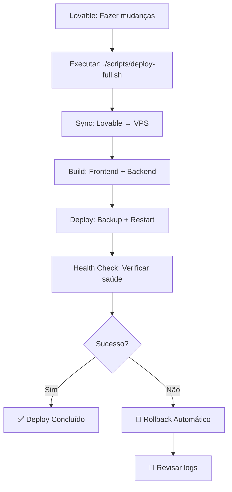

# 🚀 Sistema de Deploy Automático - Guia Completo

## ⚡ Deploy em 1 Comando

```bash
# Configurar uma vez
./scripts/setup-deploy.sh

# Deploy completo automático  
./scripts/deploy-full.sh
```

**Pronto!** Sua aplicação será sincronizada, compilada e deployada automaticamente.

## 🎯 Fluxo Automático



## 📋 Scripts Principais

### 1. **deploy-full.sh** - Recomendado
- ✅ Sync completo do Lovable
- ✅ Build automático na VPS  
- ✅ Backup antes do deploy
- ✅ Rollback em caso de falha
- ✅ Health checks
- ✅ Zero downtime

### 2. **deploy-with-sync.sh** - Na VPS
- ✅ Build com validação TypeScript
- ✅ Backup automático
- ✅ Rollback manual: `--rollback`
- ✅ Health checks robustos

### 3. **quick-deploy.sh** - Rápido
- ⚡ Apenas restart (sem sync)
- 🔄 Build incremental
- ⏰ ~30 segundos

## 🔧 Configuração Inicial

### 1. Configurar Scripts
```bash
# Dar permissões e configurar
./scripts/setup-deploy.sh

# Configurar IP da VPS nos scripts
nano scripts/sync-from-lovable.sh  # Linha: VPS_HOST
nano scripts/deploy-full.sh        # Linha: VPS_HOST
```

### 2. Testar Conectividade
```bash
# Testar SSH
ssh root@your-vps-ip "echo 'SSH OK'"

# Testar aplicação
curl https://tumihortifruti.com.br/gestao
```

## 🚨 Solução de Problemas

### Deploy Falha - Rollback Automático
```bash
# O sistema faz rollback automático, mas se precisar manual:
ssh root@your-vps-ip
cd /var/www/tumi/gestao
./scripts/deploy-with-sync.sh --rollback
```

### Erro TypeScript
```bash
# Ver logs na VPS
ssh root@your-vps-ip
pm2 logs tumi-gestao-api

# Build local para debug
npm run build:server
```

### Aplicação não Inicia
```bash
# Health check
curl http://localhost:3001/api/health

# Restart manual
pm2 restart tumi-gestao-api

# Ver status
pm2 status
```

## 📊 Monitoramento

### Dashboard PM2
```bash
# Status geral
pm2 status

# Logs em tempo real  
pm2 logs tumi-gestao-api

# Monitoramento detalhado
pm2 monit
```

### Logs Importantes
```bash
# Logs da aplicação
tail -f /var/log/tumi-gestao/combined.log

# Logs do Nginx
tail -f /var/log/nginx/error.log

# Logs do sistema
journalctl -f -u nginx
```

## 🎯 Casos de Uso

### Deploy Diário Normal
```bash
# No Lovable, após fazer mudanças:
./scripts/deploy-full.sh

# Aguardar mensagem de sucesso
# Verificar: https://tumihortifruti.com.br/gestao
```

### Deploy de Correção Urgente
```bash
# 1. Fix no Lovable
# 2. Deploy automático
./scripts/deploy-full.sh

# 3. Se falhar, rollback automático acontece
# 4. Se precisar rollback manual:
ssh root@your-vps-ip
cd /var/www/tumi/gestao  
./scripts/deploy-with-sync.sh --rollback
```

### Deploy de Funcionalidade Nova
```bash
# 1. Implementar no Lovable
# 2. Testar localmente
npm run deploy:validate  # (se possível)

# 3. Deploy completo
./scripts/deploy-full.sh

# 4. Monitorar logs pós-deploy
ssh root@your-vps-ip
pm2 logs tumi-gestao-api
```

## 🔄 Workflow Recomendado

### Desenvolvimento → Produção

1. **Lovable**: Fazer mudanças e testar
2. **Deploy**: `./scripts/deploy-full.sh`  
3. **Verificar**: https://tumihortifruti.com.br/gestao
4. **Monitorar**: Logs por alguns minutos
5. **Rollback**: Se necessário, automático ou manual

### Manutenção

- **Backups**: Automáticos antes de cada deploy
- **Logs**: Rotacionados automaticamente
- **Health**: Verificação contínua
- **SSL**: Renovação automática (certbot)

## 🏆 Benefícios

- ✅ **Zero Config**: Após setup inicial
- ✅ **Zero Downtime**: Deploy sem interrupção
- ✅ **Zero Stress**: Rollback automático
- ✅ **Full Backup**: Antes de cada deploy
- ✅ **Health Checks**: Validação automática
- ✅ **Logs Detalhados**: Para debugging

---

## 🎊 Quick Start

```bash
# 1. Configurar (uma vez)
./scripts/setup-deploy.sh

# 2. Deploy (sempre)
./scripts/deploy-full.sh
```

**That's it!** ✨

---

📖 **Documentação Completa**: `DEPLOY-COMMANDS.md`  
🔧 **Troubleshooting**: `scripts/monitor.sh detailed`